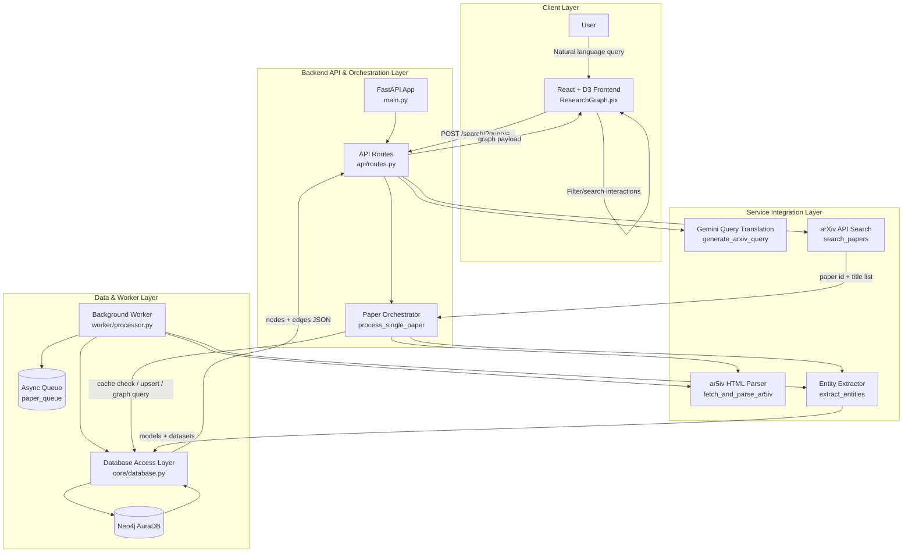

# Scientific Literature Knowledge Graph

This project builds an interactive knowledge graph of scientific papers, models, and datasets by combining:
- a FastAPI backend pipeline,
- a Neo4j graph database,
- and a React + D3 frontend.

---

## Repository Structure

| Module | Path | Responsibility |
|---|---|---|
| Backend API | `Backend/main.py`, `Backend/api/routes.py` | Serves endpoints, orchestrates search + extraction + graph response |
| Backend Core | `Backend/core/config.py`, `Backend/core/database.py` | Environment config and Neo4j connection/query logic |
| Backend Services | `Backend/services/*` | arXiv retrieval, HTML parsing, LLM query translation, entity extraction |
| Backend Worker | `Backend/worker/*` | Async queue + background processor for paper ingestion |
| Frontend App | `Frontend/Frontend/src/*` | Search, filter, and visualize graph data using D3 |

---

## High-Level Architecture



---

## Module Interactions

### Interaction Graph (Backend + Frontend)

```mermaid
flowchart LR
    subgraph Frontend
      FEAPP[App.jsx]
      FEGR[ResearchGraph.jsx]
      D3V[D3 Visualization Layer]
      FEAPP --> FEGR --> D3V
    end

    subgraph Backend
      MAIN[main.py]
      ROUTES[api/routes.py]
      CONFIG[core/config.py]
      DBCORE[core/database.py]
      QUEUE[worker/queue.py]
      WORKER[worker/processor.py]
      ARX[services/arxiv.py]
      LLM[services/cloud_llm.py]
      PARSER[services/html_parser.py]
      PIPE[services/process_paper.py]

      MAIN --> ROUTES
      MAIN --> DBCORE
      MAIN --> WORKER
      WORKER --> QUEUE
      ROUTES --> ARX
      ROUTES --> LLM
      ROUTES --> PIPE
      PIPE --> PARSER
      PIPE --> LLM
      PIPE --> DBCORE
      WORKER --> PARSER
      WORKER --> LLM
      WORKER --> DBCORE
      CONFIG --> DBCORE
      CONFIG --> LLM
    end

    FEGR -->|POST /search| ROUTES
    ROUTES -->|{nodes, edges}| FEGR
```

### Runtime sequence for primary user flow (`/search`)

```mermaid
sequenceDiagram
    participant User
    participant FE as Frontend (ResearchGraph)
    participant API as FastAPI /search route
    participant LLMQ as Gemini Query Translator
    participant ARX as arXiv API
    participant PROC as Paper Processor (concurrent)
    participant AR5 as ar5iv HTML
    participant LLME as LLM Entity Extractor
    participant DB as Neo4j + DB Layer

    rect rgb(12, 22, 40)
    User->>FE: Enter query + click Search
    FE->>API: POST /search/?query=...
    end

    rect rgb(16, 32, 52)
    API->>LLMQ: generate_arxiv_query()
    LLMQ-->>API: arXiv boolean query
    API->>ARX: search_papers()
    ARX-->>API: top paper list
    end

    rect rgb(22, 36, 58)
    par For each paper
        API->>PROC: process_single_paper()
        PROC->>DB: check_if_paper_exists()
        alt not indexed
            PROC->>AR5: fetch_and_parse_ar5iv()
            PROC->>LLME: extract_entities()
            PROC->>DB: save_graph_to_db()
        end
    end
    end

    rect rgb(18, 30, 50)
    API->>DB: get_graph_for_papers()
    DB-->>API: nodes + edges
    API-->>FE: graph payload
    FE-->>User: Interactive filtered graph
    end
```



---

## Backend Endpoints

| Method | Endpoint | Params | Purpose | Used by Frontend |
|---|---|---|---|---|
| GET | `/` | None | Health/info response | No |
| POST | `/test-queue/{paper_id}` | Path: `paper_id` | Queue a paper for background worker testing | No |
| POST | `/test-translate/` | Query param: `query` | Translate natural-language query to arXiv query string | No |
| POST | `/search/` | Query param: `query` | Main pipeline: translate query, fetch papers, process entities, return graph | **Yes** (`ResearchGraph.jsx`) |

### Frontend-to-Backend contract used in UI

| Frontend action | Backend endpoint | Request format | Response fields consumed |
|---|---|---|---|
| Global search (header input) | `POST /search/?query=<text>` | Query param in URL | `payload.graph.nodes`, `payload.graph.edges` |

---

## Database Design (Current Implementation)

### Database technology

| Item | Value |
|---|---|
| Database | Neo4j (Async driver) |
| Access pattern | Cypher via `AsyncGraphDatabase` |
| Connection source | `.env` via `NEO4J_URI`, `NEO4J_USER`, `NEO4J_PASSWORD` |

### Graph schema

| Node label | Key fields | Notes |
|---|---|---|
| `Paper` | `id`, `type='paper'`, metadata (e.g., `title`, `year`, `citationCount`) | Upserted with `MERGE` |
| `Model` | `id`, `label`, `type='model'`, `framework`, `task`, `paramCount` | Shared across papers via stable generated IDs |
| `Dataset` | `id`, `label`, `type='dataset'`, `size`, `task` | Shared across papers via stable generated IDs |

| Relationship | Direction | Meaning |
|---|---|---|
| `USES_MODEL` | `(:Paper)-[:USES_MODEL]->(:Model)` | Paper uses/evaluates model |
| `USES_DATASET` | `(:Paper)-[:USES_DATASET]->(:Dataset)` | Paper uses/evaluates dataset |

---

## UI Filters (Current Frontend)

All active filtering logic is implemented in `Frontend/Frontend/src/components/ResearchGraph.jsx`.

| Filter type | UI control | Scope | Behavior |
|---|---|---|---|
| Node type toggle | Buttons: Papers / Models / Datasets | All nodes | Hides selected node categories; edges shown only when both endpoints remain visible |
| Year range | Two sliders: FROM / TO | `paper` nodes with `metadata.year` | Keeps papers within `[yearMin, yearMax]` |
| Minimum citations | Slider (`step=500`) | `paper` nodes with `metadata.citationCount` | Keeps papers with citationCount >= threshold |
| Local filter text | Sidebar input (`filter loaded nodes…`) | Node `label` and paper `metadata.title` | Case-insensitive substring matching against loaded graph |
| Reset Graph | Button | All filters + selection | Resets filters to defaults and clears local search + selected node |

---

## Design Document

### Design Review Summary

The system uses a modular, service-oriented backend pipeline and a graph-native database to support flexible exploration of literature entities. The main design strength is clear separation of concerns: query translation, paper retrieval, extraction, persistence, and visualization are isolated into dedicated modules. Recommended next design improvement is to formalize API schemas and error contracts for stronger frontend-backend stability.

### Main Design Part

#### High-level design (DFD / flow)

```mermaid
flowchart LR
    subgraph Input
      UQ[User Query]
    end

    subgraph Presentation
      UI[Frontend Search + Filters]
      GFX[Graph Rendering (D3)]
    end

    subgraph API
      EP[/POST /search/]
      ORCH[Search Orchestration]
    end

    subgraph Retrieval_Extraction
      TQ[Translate Query]
      SRCH[Search arXiv]
      PP[Process Papers Concurrently]
      PARSE[Parse ar5iv HTML]
      EXTR[Extract Model/Dataset Entities]
    end

    subgraph Persistence
      UPSERT[Upsert Graph Entities]
      READ[Query Graph for Paper IDs]
      NEO[(Neo4j Graph DB)]
    end

    UQ --> UI --> EP --> ORCH
    ORCH --> TQ --> SRCH --> PP
    PP --> PARSE --> EXTR --> UPSERT --> NEO
    ORCH --> READ --> NEO
    NEO --> READ --> ORCH --> GFX
```

#### Low-level design (algorithmic view)

| Algorithmic unit | Input | Output | Core logic |
|---|---|---|---|
| Query translation | User text query | arXiv boolean query string | Prompt-based rewrite with constrained format |
| Paper retrieval | arXiv query | Top-N papers | HTTP request to arXiv API + XML parse |
| Paper processing | Paper metadata | Persisted graph entities | Check cache -> fetch ar5iv HTML -> extract entities -> save |
| Graph assembly | List of paper IDs | `{nodes, edges}` | Match papers and outgoing relationships in Neo4j, normalize for frontend |
| Frontend filtering | Loaded graph + filter state | Visible subgraph | Node predicates + edge endpoint consistency filtering |

---

## Notes

- Frontend expects backend at `VITE_API_BASE_URL` (default: `http://127.0.0.1:8000`).
- CORS is currently configured in backend for Vite local dev origins (`localhost:5173`, `127.0.0.1:5173`).
