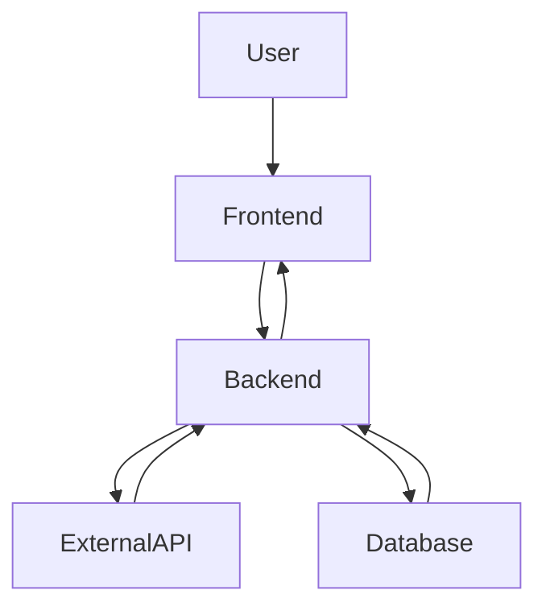
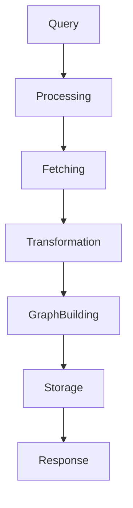
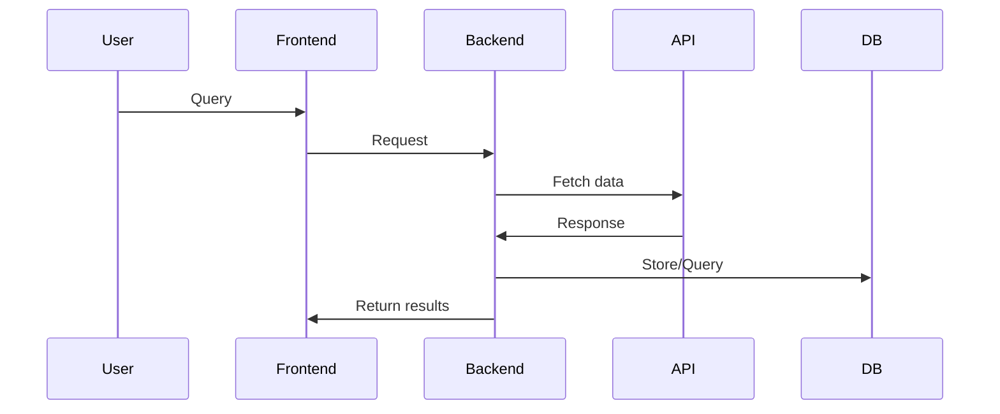

# Scientific Literature Knowledge Graph

A full-stack application that searches arXiv papers, extracts model/dataset entities with LLMs, stores relationships in Neo4j, and visualizes the resulting graph in an interactive React UI.

## Features

- Natural-language query input translated into arXiv API search syntax.
- arXiv paper retrieval with async HTTP and rate-limit delay handling.
- Paper HTML ingestion from ar5iv and text extraction via BeautifulSoup.
- LLM-based structured entity extraction (models and datasets).
- Neo4j graph persistence with deduplicated `Paper`, `Model`, and `Dataset` nodes.
- API endpoint that returns graph JSON (`nodes`, `edges`) for frontend rendering.
- Interactive D3 force-directed visualization with filtering, local search, and node detail panel.
- Background worker + async queue support for queued processing test route.

## Architecture

### High-Level Architecture



### Data Pipeline



### Sequence Diagram



## Tech Stack

### Frontend
- React 19
- D3.js
- Vite
- ESLint

### Backend
- Python
- FastAPI
- Neo4j Python Driver (async)
- httpx
- BeautifulSoup4 + lxml
- Pydantic
- python-dotenv
- Google GenAI SDK (`google-genai`)
- GLM-OCR SDK (`glmocr`, present in codebase for PDF parsing path)

### External Services
- arXiv API (`export.arxiv.org`)
- ar5iv HTML mirror (`ar5iv.labs.arxiv.org`)
- Google-hosted LLM models used by backend service calls
- Neo4j database

## Folder Structure

```text
.
├── Backend
│   ├── api
│   │   └── routes.py            # FastAPI routes (/, /test-queue, /test-translate, /search)
│   ├── core
│   │   ├── config.py            # Env var loading
│   │   └── database.py          # Neo4j connection + graph read/write logic
│   ├── services
│   │   ├── arxiv.py             # arXiv search and optional PDF download
│   │   ├── cloud_llm.py         # Query translation + entity extraction
│   │   ├── html_parser.py       # ar5iv HTML fetch + parse
│   │   ├── process_paper.py     # End-to-end single-paper pipeline
│   │   └── vision_llm.py        # GLM-OCR PDF-to-markdown utility
│   ├── worker
│   │   ├── queue.py             # Async queue singleton
│   │   └── processor.py         # Background worker loop
│   ├── config.yaml              # GLM-OCR related config
│   └── main.py                  # FastAPI app, CORS, lifespan, worker startup
├── Frontend
│   ├── package-lock.json
│   └── Frontend
│       ├── src
│       │   ├── components
│       │   │   └── ResearchGraph.jsx  # Main graph UI and D3 rendering
│       │   ├── App.jsx
│       │   └── main.jsx
│       └── package.json
└── README.md
```

## How It Works

1. The frontend loads with built-in dummy graph data and renders an interactive D3 graph.
2. A user enters a query in the UI search input.
3. Frontend sends `POST /search/?query=...` to the FastAPI backend.
4. Backend translates natural language query into an arXiv-compatible boolean query.
5. Backend calls arXiv API to fetch top papers (id/title).
6. For each paper, backend checks Neo4j cache:
   - If paper exists, extraction is skipped.
   - If not, backend fetches ar5iv HTML, extracts text, runs entity extraction, and stores nodes/relations in Neo4j.
7. Backend queries Neo4j for the resulting subgraph and returns `{ nodes, edges }`.
8. Frontend normalizes graph payload, updates visualization, and enables filtering/highlighting/detail inspection.

## Setup Instructions

### 1) Prerequisites

- Python 3.10+
- Node.js 18+
- A running Neo4j instance

### 2) Environment Variables (Backend)

Create `Backend/.env`:

```env
NEO4J_URI=bolt://<host>:7687
NEO4J_USER=neo4j
NEO4J_PASSWORD=<password>
GEMINI_API_KEY=<your_key>
```

`NEO4J_USER` defaults to `neo4j` in code if not provided.

### 3) Backend Install + Run

From repository root:

```bash
cd Backend
python -m venv .venv
source .venv/bin/activate
pip install fastapi uvicorn neo4j python-dotenv httpx beautifulsoup4 lxml pydantic google-genai glmocr
uvicorn main:app --reload --host 127.0.0.1 --port 8000
```

### 4) Frontend Install + Run

From repository root:

```bash
cd Frontend/Frontend
npm ci
npm run dev
```

The frontend expects backend at `http://127.0.0.1:8000` by default.  
To override, set `VITE_API_BASE_URL` in `Frontend/Frontend/.env.local`:

```bash
VITE_API_BASE_URL=http://<backend-host>:<port>
```

### 5) Optional Frontend Checks

From `Frontend/Frontend`:

```bash
npm run lint
npm run build
```
