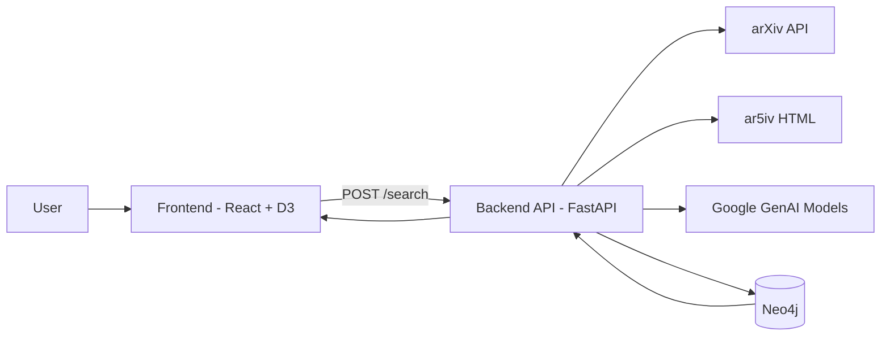
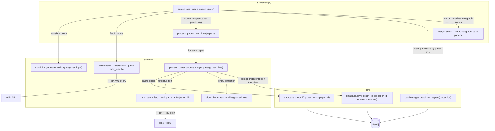
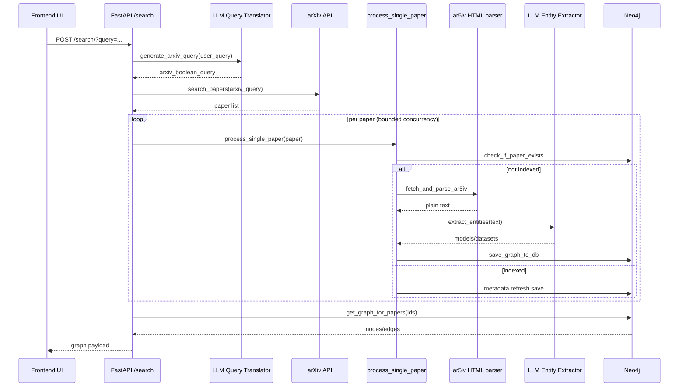
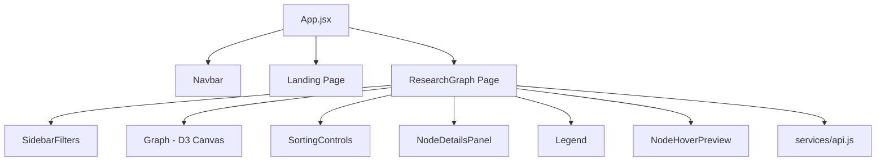
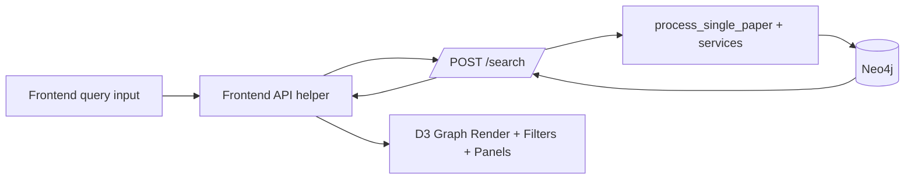

# Scientific Literature Knowledge Graph

A full-stack research exploration system that:

- Accepts natural-language research queries
- Translates them to arXiv API search syntax with an LLM
- Retrieves papers from arXiv
- Extracts entities (models and datasets) from full text
- Stores/query relationships in Neo4j
- Visualizes the resulting graph interactively in React + D3

---

## 1) What the Project Does

This project builds an **interactive knowledge graph of scientific literature** centered on:

- **Paper nodes**
- **Model nodes**
- **Dataset nodes**
- **Author nodes**
- Relationships like `uses_model`, `uses_dataset`, `written_by`, and `cites`

Users search from the frontend, the backend ingests/arbitrates data + extraction + graph persistence, and the frontend renders and filters the graph in real time.

---

## 2) High-Level Architecture



---

## 3) Repository Structure (Current)

| Path | Purpose |
|---|---|
| `Backend/main.py` | FastAPI app bootstrap, lifespan, CORS, router wiring |
| `Backend/api/routes.py` | API endpoints and top-level orchestration for search pipeline |
| `Backend/core/config.py` | Environment-driven runtime settings |
| `Backend/core/database.py` | Neo4j connect/read/write, graph shaping, metadata sanitization |
| `Backend/services/arxiv.py` | arXiv query + paper parsing + GitHub link extraction |
| `Backend/services/html_parser.py` | ar5iv HTML fetch + plain text extraction |
| `Backend/services/cloud_llm.py` | Query translation + entity extraction via Google GenAI |
| `Backend/services/process_paper.py` | Per-paper processing pipeline with timeouts |
| `Backend/services/vision_llm.py` | Optional GLM-OCR PDF parsing utility |
| `Backend/worker/*` | Async queue + background worker infrastructure |
| `Frontend/src/pages/Landing.jsx` | Product/feature landing page |
| `Frontend/src/pages/ResearchGraph.jsx` | Main graph explorer page (active implementation) |
| `Frontend/src/components/*` | Graph rendering, filters, legend, sort controls, details panel, navbar |
| `Frontend/src/services/api.js` | Frontend API client, normalization, metrics, export helpers |
| `Frontend/src/components/ResearchGraph.jsx` | Legacy monolithic graph implementation (not used by active routes) |

---

## 4) Backend Architecture

### 4.1 Backend module interaction



### 4.2 Runtime lifecycle

- `main.py` connects Neo4j on startup (`db.connect()`)
- Creates background worker tasks (`CONCURRENCY_LIMIT = 3`)
- Registers CORS for frontend dev origins (`localhost:5173`)
- Registers API router
- On shutdown: cancels workers and closes DB

### 4.3 Backend modules and responsibilities

| Module | Core responsibilities | Key interactions |
|---|---|---|
| `api/routes.py` | Endpoint definitions, query translation call, arXiv fetch, concurrent processing, graph fetch + merge metadata | Calls `cloud_llm`, `arxiv`, `process_paper`, `database` |
| `core/config.py` | Loads env vars and timeout/concurrency settings | Used across backend |
| `core/database.py` | Neo4j connect/close, cache check, metadata sanitization, graph persistence, graph read projection | Talks to Neo4j driver |
| `services/arxiv.py` | arXiv API XML parsing, metadata normalization, GitHub link extraction from paper pages | Called from `/search` |
| `services/cloud_llm.py` | LLM prompt-based arXiv query generation + JSON-schema entity extraction | Uses Google GenAI SDK |
| `services/html_parser.py` | Downloads and strips ar5iv HTML into plain text for extraction | Used in paper processing |
| `services/process_paper.py` | End-to-end single paper ingest with timeout wrappers and DB caching logic | Uses parser, LLM, DB |
| `services/vision_llm.py` | Alternate OCR/markdown extraction path via GLM-OCR | Optional utility path |
| `worker/queue.py` | Shared asyncio queue | Used by test worker route/process |
| `worker/processor.py` | Continuous queue consumer for background processing | Uses parser, LLM, DB |

### 4.4 Search pipeline sequence



---

## 5) Backend API Endpoints

| Method | Path | Used by frontend? | Purpose | Response shape |
|---|---|---|---|---|
| `GET` | `/` | No | Health/info message | `{ "message": ... }` |
| `POST` | `/search/` | **Yes** | Main query → arXiv → extraction → Neo4j graph flow | `{ search_query, results_found, graph: { nodes, edges } }` |
| `POST` | `/test-translate/` | No (dev/test) | Test query translation only | `{ user_input, arxiv_query }` |
| `POST` | `/test-queue/{paper_id}` | No (dev/test) | Push paper id to background queue | `{ message }` |

### Frontend→Backend contract notes

- Frontend calls: `POST {VITE_API_BASE_URL}/search/?query=...`
- Frontend currently may append `year_from`, `year_to`, `sort_by`, `order` query params in API helper; backend route only explicitly uses `query`.
- Backend response is normalized on frontend to ensure robust node/edge typing.

---

## 6) Frontend Architecture

### 6.1 Frontend component architecture



### 6.2 Active frontend flow

1. `App.jsx` sets theme and routes (`/`, `/graph`)
2. `pages/ResearchGraph.jsx` manages:
   - raw graph data
   - filters/sort/top-k/bookmarks
   - API search states (loading/error)
3. `components/Graph.jsx` renders D3 force-directed graph
4. Sidebars control visibility/filter/ranking/export
5. Details panel and hover preview surface metadata and derived metrics

---

## 7) Frontend Features (Detailed)

### 7.1 Search and data-loading features

| Feature | Behavior |
|---|---|
| Backend search bar | Sends query to backend `/search/` |
| Demo fallback data | Loads rich in-app dummy graph when backend unavailable/empty |
| Graph normalization | Sanitizes/normalizes incoming nodes/edges before rendering |
| Timeout handling | Shows user-facing timeout/backend-unavailable errors |

### 7.2 Filtering features (SidebarFilters)

| Filter category | Supported controls |
|---|---|
| Text search | Local graph filter over label/title/TLDR/abstract |
| Node type toggles | Paper / Model / Dataset / Author |
| Publication year | Min/max numeric + dual range sliders |
| Min citations | Slider with dynamic max and paper count indicator |
| Access type | Open-access / closed-access toggles |
| Edge visibility | `uses_model`, `uses_dataset`, `cites`, `written_by` toggles |
| Venue filter | Multi-select venue chips/list |
| Field-of-study filter | Multi-select fields |
| Author filter | Multi-select author list |
| Reset all | Restores full default filter state |

### 7.3 Ranking, scope, and actions (SortingControls)

| Feature | Options |
|---|---|
| Sort key | Citations, Influential citations, Most recent, Graph degree, Impact score, A–Z |
| Sort order | Desc / Asc |
| Node cap | 25 / 50 / 100 / 200 |
| Top-K papers mode | Top 5 / 10 / 20 / 50 (by citation) |
| Export | JSON and CSV export of current visible graph |
| Graph reset | Restores demo graph + clears transient graph UI state |
| Bookmark utilities | Bookmark count and clear-all bookmarks |
| Insight cards | Most cited, highest impact, summary metrics |

### 7.4 Graph interaction features (Graph.jsx)

| Interaction | Behavior |
|---|---|
| Zoom/pan | Mouse/touch zoom and pan over D3 canvas |
| Node drag | Reposition nodes with drag behavior |
| Hover | Live tooltip with metadata preview |
| Click | Select node and open details panel |
| Double-click | Focus/highlight connected subgraph |
| Edge visibility | Per-edge-type runtime visibility based on filters |
| Visual encoding | Distinct node shapes/colors by type + edge style by relationship |

### 7.5 Node details panel features

| Section | What it shows |
|---|---|
| Info tab | Metadata rows, TLDR, abstract expansion, links |
| Connections tab | Connected nodes with quick navigation |
| Similar papers tab | Similarity based on shared graph neighbors |
| Metrics | Impact score, citation density, open-access status |
| External links | PDF, paper URL, GitHub URL when available |
| Bookmarking | Toggle bookmarked state per node |

---

## 8) Data Model and Graph Schema

### Node types

- `paper`
- `model`
- `dataset`
- `author`

### Edge types

- `uses_model`
- `uses_dataset`
- `written_by`
- `cites`
- fallback: `connected_to`

### Graph payload contract

```json
{
  "nodes": [
    {
      "id": "...",
      "type": "paper|model|dataset|author",
      "label": "...",
      "metadata": { "...": "..." }
    }
  ],
  "edges": [
    {
      "id": "...",
      "source": "node_id",
      "target": "node_id",
      "type": "uses_model|uses_dataset|written_by|cites|connected_to"
    }
  ]
}
```

---

## 9) External Dependencies

## 9.1 Frontend dependencies (`Frontend/package.json`)

| Package | Role |
|---|---|
| `react`, `react-dom` | UI rendering |
| `d3` | Graph layout + drawing |
| `axios` | HTTP client |
| `react-router-dom` | Routing |
| `tailwindcss`, `@tailwindcss/vite` | Styling pipeline |
| `vite`, `@vitejs/plugin-react` | Build/dev tooling |
| `eslint`, `@eslint/js`, `eslint-plugin-react-hooks`, `eslint-plugin-react-refresh`, `globals` | Linting |
| `@types/react`, `@types/react-dom` | Type packages used in tooling ecosystem |

## 9.2 Backend dependencies (full pinned list)

The backend has a full pinned lock-style dependency list in:

- `Backend/requirements.txt`

Primary runtime libraries used directly in code paths include:

- `fastapi`, `starlette`, `uvicorn`
- `neo4j` (async driver)
- `python-dotenv`
- `httpx`
- `beautifulsoup4`, `lxml`
- `pydantic`
- `google-genai` (Google GenAI client)
- `glmocr` (optional PDF/OCR route)

## 9.3 External services/APIs integrated

| Service | Usage |
|---|---|
| arXiv API (`export.arxiv.org`) | Paper search |
| ar5iv (`ar5iv.labs.arxiv.org`) | HTML full-text retrieval |
| Google GenAI | Query translation + entity extraction |
| Neo4j | Graph persistence and querying |

---

## 10) Configuration

### Backend environment variables (`Backend/.env`)

| Variable | Required | Description |
|---|---|---|
| `NEO4J_URI` | Yes | Neo4j connection URI |
| `NEO4J_USER` | Optional | Defaults to `neo4j` |
| `NEO4J_PASSWORD` | Yes | Neo4j password |
| `GEMINI_API_KEY` | Yes | API key for GenAI calls |
| `PAPER_PROCESS_CONCURRENCY` | Optional | Concurrent paper processing limit |
| `PAPER_HTML_TIMEOUT_SECONDS` | Optional | ar5iv fetch timeout |
| `PAPER_EXTRACTION_TIMEOUT_SECONDS` | Optional | LLM extraction timeout |
| `PAPER_DB_TIMEOUT_SECONDS` | Optional | DB write timeout |

### Frontend environment variables

| Variable | Required | Description |
|---|---|---|
| `VITE_API_BASE_URL` | Optional | Backend base URL (default `http://127.0.0.1:8000`) |

---

## 11) Run Instructions

### Cloning the GitHub Repository:-

```bash
git clone https://github.com/Group18SWE/Scientific_Literature_Knowledge_Graph.git
```

### Backend

```bash
python -m venv .venv
source .venv/bin/activate
pip install -r requirements.txt
cd Backend
uvicorn main:app --reload --host 127.0.0.1 --port 8000
```
### Note-
You need to get environmental variables like API keys into the backend for running it.
Like your Gemini API Key and Neo4j credentials. 

### Frontend

```bash
cd Frontend
npm install
npm run dev
```

Frontend default dev URL is typically `http://localhost:5173`.

---

## 12) Implementation Notes and Current-State Caveats

- `Frontend/src/components/ResearchGraph.jsx` is a **legacy monolithic graph component**; active route uses `Frontend/src/pages/ResearchGraph.jsx` + modular components.
- Backend includes queue/worker test endpoints (`/test-queue`, `/test-translate`) in addition to main `/search` path.
- `Backend/services/core_records.json` is a large sample/raw records artifact and not the active API response contract.
- `Backend/services/vision_llm.py` and `Backend/config.yaml` support an OCR/PDF path that is currently secondary to ar5iv HTML extraction.

---

## 13) Frontend-Backend Interaction Diagram


